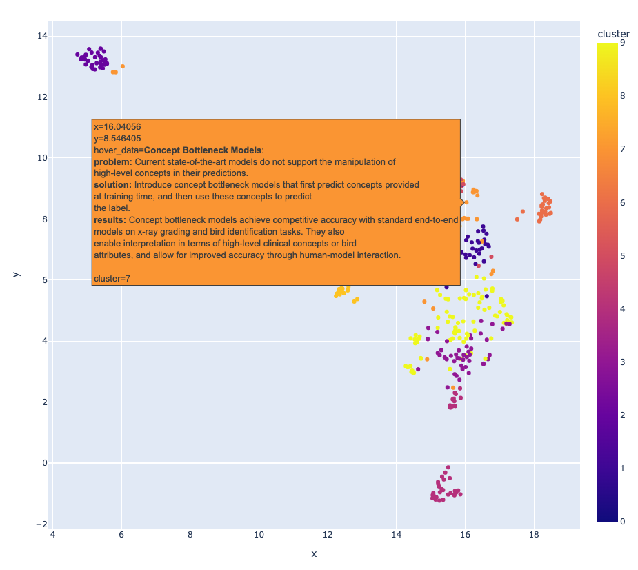

# Zotero search

Small repo using the openAI api to allow managing a Zotero collection of papers to perform:
    * **search**: search of a paper given a query sentence.
    * **clustering**: clustering of the papers in the collection. 

How to use it ?

1. Export your Zotero collection to csv (File > Export Library): `assets/bibli.csv`
2. Embeds your abstracts: `python embed.py`. You can also choose to further summarize the abstracts by setting `summarize=True` in the `embed.py` file.
3. Search  for a paper: `python search.py "impact of the Per capita consumption of mozzarella cheese on the number of civil engineering doctorates awarded"` ([source](https://www.tylervigen.com/spurious-correlations))
4. Cluster your collection: `python cluster.py` 

Proximity in this embedding space is supposed to be correlated with semantic proximity.
Hover over your zotero collection !

